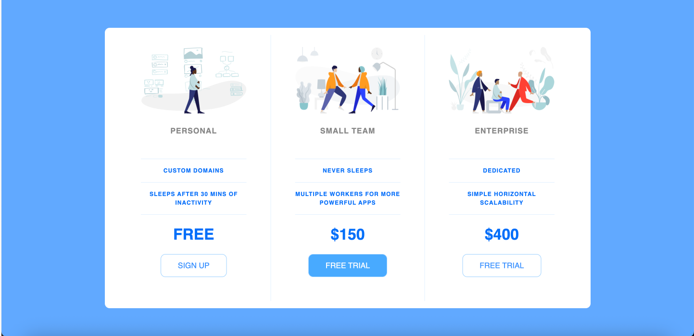

# Pricing Panel Project

This is the first web design assignment I completed！ It's a very simple layout built with **HTML and CSS**.

The design is based on this [CodePen example](https://codepen.io/travisw/pen/EvbKwd).

## 📷 Screenshot

## 🛠 Technologies Used

- HTML5
- CSS3

## 📁 Project Structure
 pricing-panel-project/ 
 ├── index.html 
 ├── style.css 
 └── icons/ 

## ✨ What I Learned

This was the **first web page** I’ve ever built from scratch, so it was a really valuable learning experience for me!

Here are some of the things I practiced and picked up along the way:

1. I learned how to **reset default browser styles** using a CSS reset (based on [Meyerweb Reset](http://meyerweb.com/eric/tools/css/reset/)) — it helps start from a clean slate.
2. I applied some of the CSS basics I’ve learned so far, like:
   - `border`, `border-radius`
   - `flex` layout for arranging elements
   - `text-transform` to change letter case
   - spacing with `padding`, `margin`, and `letter-spacing`
   - styling fonts using `font-family`, `font-size`, and `font-weight`
3. I also used a **media query** (`@media (min-width: 900px)`) to make the layout responsive — it adjusts from column to row on wider screens.
4. Lastly, I got more comfortable with **hover and focus effects** for buttons to make the UI feel a bit more interactive.

It’s a super simple layout, but I’m really happy with how it turned out as my first try!🎉
